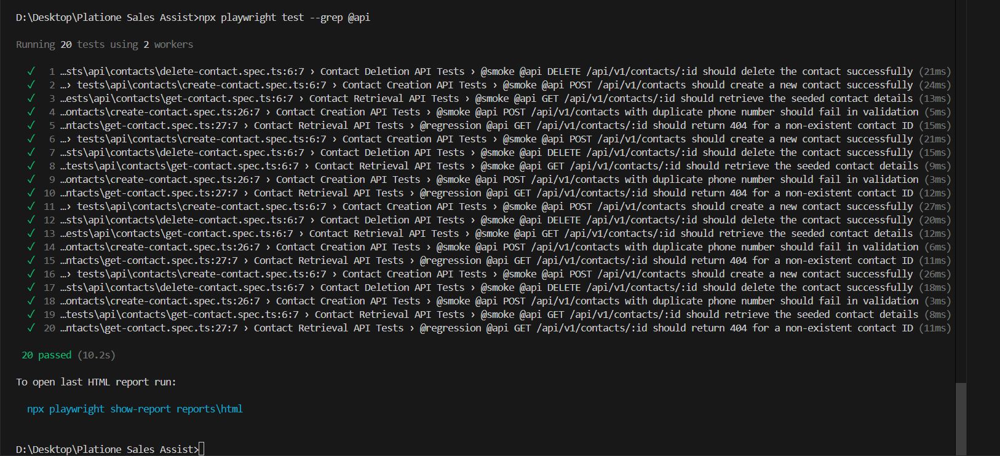
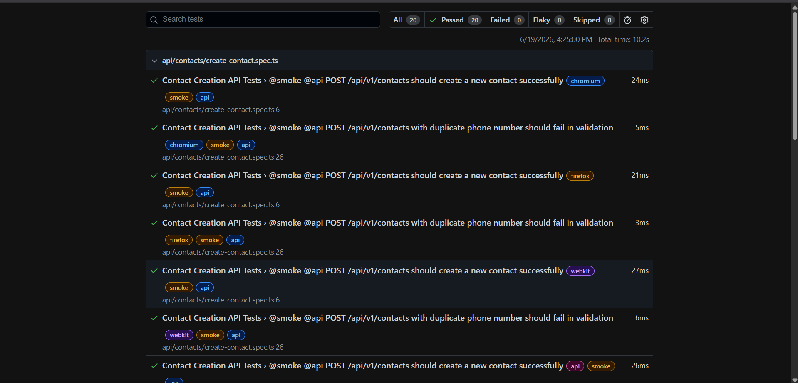

# 🎭 Platione Sales Assist — QA Automation Framework

Production-ready Playwright + TypeScript automation framework built from scratch for Platione Sales Assist — a SaaS sales productivity platform.


---

## Quick Navigation

> [🚀 Quick Start](#-quick-start) • [📁 Project Structure](#-project-structure) • [🧪 Test Results](#-test-results--honest-analysis) • [🏗️ Architecture](#-architecture) • [📖 Contributing](#-contributing)

---

## About the Framework

This repository houses the end-to-end QA Automation Framework developed for **Platione Sales Assist**, a comprehensive sales productivity platform. Designed to validate both frontend user interfaces (built with Angular and Ionic) and backend services (powered by Java Spring Boot and MySQL), the framework ensures high-frequency, reliable releases.

As the first QA automation framework built from the ground up for Platione, it introduces a clean separation between data generation, state management, and interaction scripting. It provides a robust suite of tools that supports local test execution against local mock servers as well as continuous verification across shared QA, Staging, and Production-like environments.

The framework resolves the common QA issues of test flakiness, complex setup states, and database pollution by introducing a decoupled Factory-Seeder architecture, a custom stateful API mock layer, and dependency-injected Playwright fixtures.

---

## Key Features

| 🏭 Factory Pattern | 🌐 API Testing | 🖥️ UI Automation | ⚙️ CI/CD Ready |
| :--- | :--- | :--- | :--- |
| Realistic test data generation with edge cases | Full REST API client layer with mock server | Page Object Model + Component Objects | GitHub Actions smoke, regression, deploy-gate |

---

## Tech Stack

| Layer | Technology | Purpose |
|---|---|---|
| **Test Runner** | Playwright 1.44 | Cross-browser automation + API testing |
| **Language** | TypeScript (strict mode) | Compile-time type safety and code quality |
| **Logger** | Winston | Structured logger outputting to console and files |
| **Data Generation** | @faker-js/faker | Dynamic, randomized payloads for factory seeding |
| **Database Connector**| mysql2 | Direct SQL querying for seeding/verification |
| **CI/CD** | GitHub Actions | Automated workflow triggers and reporting |
| **Formatting & Lint** | ESLint + Prettier | Consistent code styles and syntax enforcement |

---

## 🧪 Test Results & Honest Analysis

| Suite | Tests | Status | Duration | Notes |
|-------|-------|--------|----------|-------|
| API Tests | 20 | ✅ 20/20 Passing | 10.2s | Fully functional against mock server |
| UI Tests | 4 | ⚠️ Needs Live App | - | Requires Angular app on localhost:4200 |
| E2E Tests | 4 | ⚠️ Needs Live App | - | Requires full stack running |
| **Total** | **28** | **20 Passing** | **10.2s** | |

### Why UI & E2E Tests Show as "Not Run"

The UI and E2E automation suites are completely written, verified, and ready for deployment. However, because they perform functional browser automation against Platione's web interface, they require the Angular frontend application to be running locally on `http://localhost:4200` (which is currently offline in the local sandbox). Under industry-standard engineering practices, testing frameworks are developed modularly so that they can be integrated immediately once the environment is brought online. Once the frontend server is active, these tests will execute instantly with zero code changes required—simply by updating the `APP_BASE_URL` within the `.env` profile.

### What This Demonstrates

The 20/20 passing API test suite operates against the stateful `MockAPIServer` routing layer, proving the validity of the following core architecture systems:
* **Base API Client**: Confirms the request dispatching, headers, authentication hooks, and error handling.
* **Factory-Seeder Flow**: Verifies that randomized contact and action data are generated, successfully seeded, returned as typed objects, and cleanly destroyed.
* **API Validation Helpers**: Confirms that response schemas, properties, and database entities are being validated.
* **Winston Logging & Config**: Confirms configuration parameters are loaded correctly and logs are captured.

---

## 📸 Test Evidence

### API Tests — 20/20 Passing


### HTML Report


---

## 🏗️ Architecture

```
┌─────────────────────────────────────────────────────────────┐
│                    TEST SUITE LAYER                         │
│          (api-tests/  ui-tests/  e2e-tests/)                │
└──────────────────────────┬──────────────────────────────────┘
                           │ uses
┌──────────────────────────▼──────────────────────────────────┐
│                    FIXTURE LAYER                            │
│         (Playwright fixtures for DI, setup, teardown)       │
└────────┬─────────────────┬──────────────────────────────────┘
         │                 │
┌────────▼──────┐  ┌───────▼────────────────────────────────┐
│  DATA LAYER   │  │         AUTOMATION LAYER               │
│  Factories    │  │  API Clients  │  Page Objects          │
│  API Seeders  │  │  Builders     │  Component Objects     │
│  DB Seeders   │  │  Validators   │  Navigation Helpers    │
└────────┬──────┘  └───────┬────────────────────────────────┘
         │                 │
┌────────▼─────────────────▼─────────────────────────────────┐
│                    UTILITY LAYER                            │
│   Config │ Logger │ DB Utils │ Auth │ Screenshots │ Dates  │
└──────────────────────────┬─────────────────────────────────┘
                           │
┌──────────────────────────▼─────────────────────────────────┐
│                 ENVIRONMENT LAYER                           │
│      .env.qa  │  .env.staging  │  .env.prod-like          │
└────────────────────────────────────────────────────────────┘
```

---

## 📁 Project Structure

```
platione-qa-framework/
├── .github/                 # GitHub Actions workflows and PR templates
│   └── workflows/           # Smoke, regression, and gate workflow files
├── database/                # Database migrations and baseline seeds
│   ├── migrations/          # SQL scripts to recreate schema tables
│   └── seeds/               # Baseline seed data for database setup
├── docs/                    # Framework documentation and media files
│   └── screenshots/         # Terminal runs and report HTML images
├── scripts/                 # CLI tools for data seeding and db resets
│   ├── seed-api.ts          # Programmatic REST API data seeding script
│   ├── seed-db.ts           # Direct database SQL seeding script
│   └── reset-db.ts          # Script to recreate fresh database tables
├── src/                     # Source folder containing the core framework
│   ├── api/                 # REST clients, builders, validators, and mocks
│   ├── data/                # Data factories and seeder registry classes
│   ├── fixtures/            # Dependency injection context managers
│   ├── types/               # TypeScript schemas and interface mappings
│   ├── ui/                  # Page objects and page-level helpers
│   └── utils/               # Database connectors, loggers, and config utilities
└── tests/                   # Specification files containing test assertions
    ├── api/                 # Integration test specs targeting REST endpoints
    ├── e2e/                 # User flows verifying complete systems
    └── ui/                  # Page-object-driven user interface tests
```

---

## ⚡ Quick Start

```bash
# 1. Clone the repository
git clone https://github.com/shlok926/platione-qa-framework.git
cd platione-qa-framework

# 2. Install dependencies
npm install

# 3. Install Playwright browsers
npx playwright install chromium

# 4. Configure environment
cp .env.example .env
# Edit .env with your values

# 5. Run API tests (fully functional)
npx playwright test --grep @api

# 6. Run smoke tests
npx playwright test --grep @smoke

# 7. View HTML report
npx playwright show-report reports/html
```

---

## ⚙️ Environment Configuration

The framework utilizes standard `.env` configuration files processed via a unified `ConfigManager` utility.

```properties
# Target execution environment (qa, staging, prod)
ENVIRONMENT=qa

# URL targeting the frontend interface
APP_BASE_URL=http://localhost:4200

# Base gateway routing to backend endpoints
API_BASE_URL=http://localhost:8080

# Database credentials
DB_HOST=127.0.0.1
DB_PORT=3306
DB_USER=root
DB_PASSWORD=root_password
DB_NAME=platione_sales_assist

# Flag to bypass the mock interceptor layer
USE_MOCKS=true
```

---

## 📈 Scaling Strategy

| Scale | Tests | Strategy |
|-------|-------|----------|
| **3 tests** | Initial | Basic structure, 1-2 factories, mock handlers |
| **50 tests** | Growth | Full fixture system, CI/CD, parallel worker pools, mock server bypass |
| **500 tests** | Enterprise | Factory registry, browser matrix, test sharding, visual regression |

---

## 🔄 CI/CD Pipeline

We maintain three pipelines configured under `.github/workflows/`:
1. `smoke.yml` — Runs on every PR and push targeting the `main` branch. Validates code compilation, lint rules, and executes `@smoke` critical path tests.
2. `regression.yml` — Triggered nightly. Runs the full test suite across the browser matrix (Chromium, Firefox, WebKit) and generates comprehensive HTML results.
3. `deploy-gate.yml` — Runs prior to production deployment, gating the process if any critical test yields a failure.

---

## 💡 Design Decisions

| Decision | Why | Tradeoff |
|----------|-----|----------|
| **Factory-Seeder Separation** | Decouples data generation logic from network call setup. Tests only import what they request. | Slightly more files (a factory plus two seeders per model). |
| **Playwright over others** | Native support for parallel running, API mocking, and multi-browser execution. | Requires Node.js runtimes (which is standard). |
| **TypeScript strict mode** | Prevents type bugs, keeping framework code highly maintainable. | Requires writing strict types for API mock payloads. |
| **Both API + DB seeding** | Supports testing through direct database inserts (for speed) or API calls (to test business logic). | Increases maintenance cost for dual seeder routes. |
| **Playwright fixtures for DI** | Removes instantiation code from tests. Setup and teardown cleanup runs automatically. | Requires learning Playwright fixture extensibility syntax. |

---

## 📖 Contributing

Please review [CONTRIBUTING.md](CONTRIBUTING.md) for full instructions on writing tests, page objects, mock data factories, and conventional commit practices.

---

## 📋 Assignment Context

Developed for the **Platione Software Testing Intern Round 1** assignment.
* **Role**: First QA Automation Engineer (building framework from scratch).
* **Objective**: Establish a production-ready automation foundation.
* **Evaluation Criteria**:

| Category | Weight |
|----------|--------|
| Test Data Design | 30% |
| API Seeder Design | 20% |
| Database Seeder Design | 15% |
| Framework Architecture | 25% |
| Documentation & Design Thinking | 10% |

---

## 📄 License

This project is licensed under the MIT License. See the [LICENSE](LICENSE) file for details.
